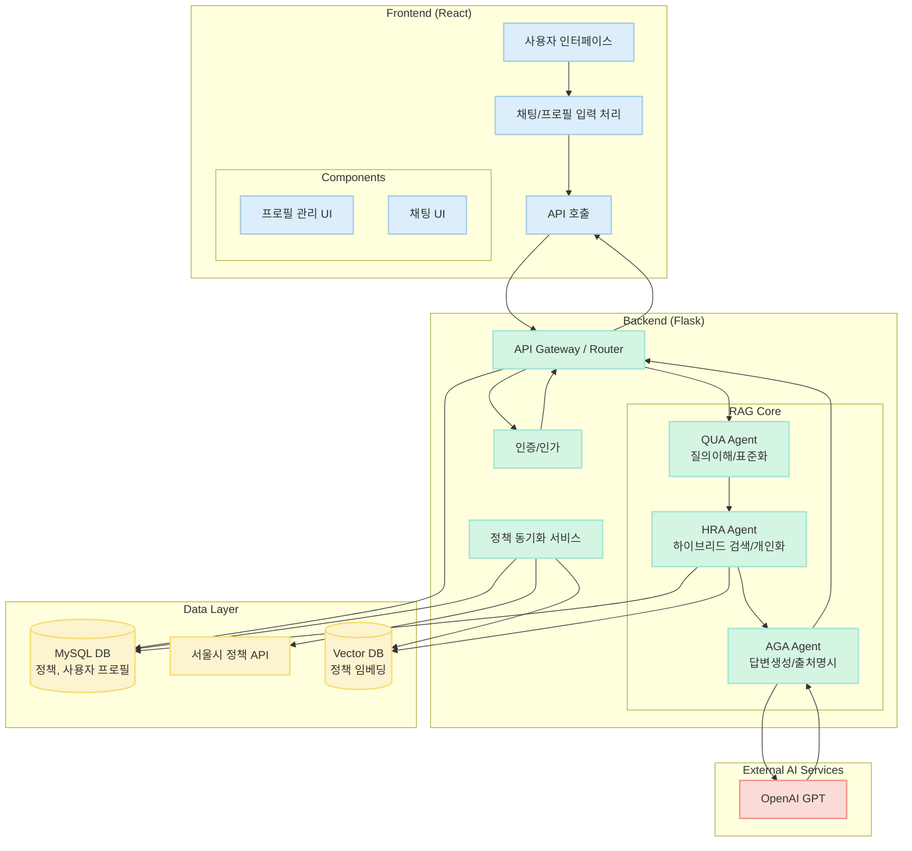

# AIBBOT - AI-Powered Seoul Childcare Policy Assistant

<div align="center">
  
  
  
  
  
</div>

## 📋 목차

- [개요](#개요)
- [주요 특징](#주요-특징)
- [시스템 아키텍처](#시스템-아키텍처)
- [기술 스택](#기술-스택)
- [학술 기반](#학술-기반)
- [타 솔루션과의 비교](#타-솔루션과의-비교)
- [설치 및 실행](#설치-및-실행)
- [API 문서](#api-문서)
- [프로젝트 구조](#프로젝트-구조)
- [기여 가이드](#기여-가이드)

## 개요

AIBBOT은 서울시 임신·출산·육아 정책 정보를 AI 기반으로 제공하는 지능형 상담 시스템이다. 다중 에이전트 RAG(Retrieval-Augmented Generation) 아키텍처를 통해 사용자의 상황에 맞는 개인화된 정책 정보를 정확하고 신뢰성 있게 전달한다.

### 🎯 핵심 목표

- **접근성 향상**: 복잡한 정책 정보를 쉽고 직관적으로 제공
- **개인화 서비스**: 사용자 프로필 기반 맞춤형 정책 추천
- **신뢰성 확보**: 모든 답변에 출처 명시 및 실시간 데이터 동기화
- **확장성 구조**: 모듈화된 에이전트 아키텍처로 향후 기능 확장 용이

## 주요 특징

### 🤖 다중 에이전트 RAG 시스템

<div align="center">
  
  <p><em>AIBBOT의 3단계 에이전트 아키텍처: QUA → HRA → AGA</em></p>
</div>

1. **QUA (Query Understanding Agent)**
   - 사용자 질문 의도 분석 및 핵심 엔티티 추출
   - 일상 용어를 표준화된 정책 용어로 매핑
   - 복합 질문 분해 및 검색 쿼리 최적화

2. **HRA (Hybrid Retrieval Agent)**
   - 메타데이터 필터링 + 키워드 검색 결합
   - 사용자 프로필 기반 개인화 점수 부여
   - 다중 경로 검색으로 재현율 극대화

3. **AGA (Answer Generation Agent)**
   - 구조화된 컨텍스트 기반 답변 생성
   - 출처 자동 명시 (📋 참고 정책 섹션)
   - 신뢰도 점수 계산 및 표시

### 📊 실시간 정책 동기화

```python
# 자동 스케줄링 설정
schedule.every().day.at("06:00").do(sync_policies)
schedule.every().monday.at("09:00").do(sync_policies)
```

- 서울열린데이터광장 API 연동
- 콘텐츠 해시 기반 실제 변경사항만 추적
- 신규/업데이트/변경없음 상태 구분 관리

### 🎨 직관적인 사용자 인터페이스

<div align="center">
  
  
  <p><em>메인 화면(좌), 채팅 인터페이스(우)</em></p>
</div>

- React 기반 반응형 웹 애플리케이션
- 실시간 채팅 인터페이스
- 정책 상세 정보 모달 뷰어
- 사용자 프로필 관리 시스템

## 시스템 아키텍처



## 기술 스택

### Backend
- **Framework**: Flask 3.1.0
- **Language**: Python 3.8+
- **Database**: MySQL 8.0
- **AI/ML**: OpenAI API (GPT-3.5-turbo)
- **주요 라이브러리**:
  - `mysql-connector-python`: DB 연결
  - `schedule`: 자동 동기화 스케줄링
  - `python-dotenv`: 환경 변수 관리

### Frontend
- **Framework**: React 18.3.1
- **Build Tool**: Vite 6.0.1
- **Styling**: Tailwind CSS 3.4.17
- **HTTP Client**: Axios 1.7.9
- **주요 특징**:
  - 컴포넌트 기반 모듈화 구조
  - 실시간 상태 관리
  - 반응형 디자인

## 학술 기반

AIBBOT의 RAG 파이프라인은 최신 학술 연구의 핵심 아이디어를 실제 서비스에 적용한 결과물이다.

### 📚 적용 논문 및 핵심 아이디어

#### 1. **Ragnarök: A Reusable RAG Framework and Baselines**
- **핵심 아이디어**: 모듈화된 RAG 파이프라인 설계 및 출처 명시(Attribution)
- **AIBBOT 적용**: 
  - QUA → HRA → AGA 3단계 모듈화 구조
  - 모든 답변에 "📋 참고 정책: [정책명] (정책ID: XX)" 형식으로 출처 자동 명시
  - `backend/rag_service.py`의 AGA 에이전트에서 구현

#### 2. **Blended RAG: Improving RAG Accuracy with Semantic Search and Hybrid Query-Based Retrievers**
- **핵심 아이디어**: 다양한 검색 전략의 혼합(Blend)
- **AIBBOT 적용**:
  - HRA 에이전트의 다중 경로 검색 구현
  - 1단계: 메타데이터 필터링 (지역, 나이, 정책 유형)
  - 2단계: 키워드 기반 검색 (정책명, 내용, 대상)
  - 3단계: 개인화 기반 리랭킹

#### 3. **Understand What LLM Needs: Dual Preference Alignment for Retrieval-Augmented Generation (DPA-RAG)**
- **핵심 아이디어**: 사용자 선호도와 LLM 선호도의 이중 정렬
- **AIBBOT 적용**:
  - 사용자 프로필 기반 개인화 점수 부여 시스템
  - 다자녀 가구, 특정 지역 거주자를 위한 정책 가중치 조정
  - 동적 순위 재조정으로 맞춤형 추천 품질 향상

#### 4. **Financial Analysis: Intelligent Financial Data Analysis System Based on LLM-RAG**
- **핵심 아이디어**: 도메인 특화 용어 표준화의 중요성
- **AIBBOT 적용**:
  - QUA 에이전트의 용어 표준화 기능
  - "강남" → "강남구", "애기" → "영아" 등 자동 매핑
  - 사용자 친화적 표현과 정책 DB 용어 간 간극 해소

#### 5. **Vul-RAG: Enhancing LLM-based Vulnerability Detection via Knowledge-level RAG**
- **핵심 아이디어**: 구조화된 지식 제공으로 LLM 성능 향상
- **AIBBOT 적용**:
  - AGA 에이전트의 구조화된 컨텍스트 구성
  - 정책별 필드 명확 구분 (정책명, 지원대상, 지원내용, 신청방법)
  - LLM의 정확한 정보 파악 및 답변 생성 지원

#### 6. **UniMS-RAG: A Unified Multi-source Retrieval-Augmented Generation for Personalized Dialogue Systems**
- **핵심 아이디어**: 다중 정보 소스의 통합적 활용
- **AIBBOT 적용**:
  - 정책 데이터베이스 + 사용자 프로필 정보 통합
  - 향후 확장 가능한 모듈화 구조
  - 다양한 정보 소스 추가 가능한 아키텍처

### 🔬 학술적 기여

AIBBOT은 이론적 연구를 실제 서비스로 구현하는 과정에서 다음과 같은 실용적 통찰을 제공한다:

1. **도메인 특화 최적화**: 범용 RAG 프레임워크를 육아 정책이라는 특정 도메인에 최적화
2. **실시간 데이터 동기화**: 정적 지식베이스가 아닌 동적 업데이트 시스템 구현
3. **사용자 경험 중심 설계**: 학술적 정확성과 사용자 친화성의 균형 추구

## 타 솔루션과의 비교

### 🏆 주요 오픈소스 RAG 프레임워크 비교

| 특징 | **AIBBOT** | LangChain | LlamaIndex | Haystack | RAGFlow |
|------|------------|-----------|------------|----------|----------|
| **멀티 에이전트 구성** | ✅ **예**<br>(QUA/HRA/AGA) | ⚠️ 일부<br>(구현 가능) | ❌ 아니오<br>(단일 인덱싱) | ❌ 아니오<br>(전통적 파이프라인) | ❌ 아니오<br>(일체형 구조) |
| **도메인 최적화** | ✅ **예**<br>(정책 QA 특화) | ❌ 아니오<br>(범용 프레임워크) | ❌ 아니오<br>(범용) | ❌ 아니오<br>(범용) | ❌ 아니오<br>(범용 문서) |
| **개인화 기능** | ⚠️ **부분**<br>(프로필 기반) | ❌ 아니오<br>(구현 필요) | ❌ 아니오<br>(미지원) | ❌ 아니오<br>(미지원) | ❌ 아니오<br>(미지원) |
| **출처 명시** | ✅ **예**<br>(자동 표기) | ⚠️ 구현 필요<br>(기본 제공 없음) | ⚠️ 부분 지원<br>(소스 추적 가능) | ✅ 예<br>(원문 출처 제공) | ✅ 예<br>(근거 기반 답변) |
| **API 통합** | ✅ **예**<br>(REST API) | ❌ 코드 통합<br>(라이브러리) | ❌ 코드 통합<br>(라이브러리) | ✅ 예<br>(REST API 제공) | ✅ 예<br>(REST API 제공) |
| **실시간 동기화** | ✅ **예**<br>(스케줄링) | ❌ 아니오 | ❌ 아니오 | ❌ 아니오 | ❌ 아니오 |
| **한국어 최적화** | ✅ **예**<br>(용어 표준화) | ❌ 아니오 | ❌ 아니오 | ❌ 아니오 | ❌ 아니오 |

### 💡 AIBBOT의 차별점

1. **도메인 전문성**: 육아 정책이라는 특정 도메인에 완전히 최적화된 시스템
2. **실용적 구현**: 학술 이론을 실제 서비스로 구현한 검증된 아키텍처
3. **한국 환경 최적화**: 서울시 API 연동, 한국어 자연어 처리 최적화
4. **엔드투엔드 솔루션**: 데이터 수집부터 사용자 인터페이스까지 완성된 시스템

## 설치 및 실행

### 사전 요구사항

- Python 3.8 이상
- Node.js 16.0 이상
- MySQL 8.0 이상
- OpenAI API 키

### 1. 저장소 클론

```bash
git clone https://github.com/yourusername/aibbot.git
cd aibbot
```

### 2. 환경 변수 설정

`.env` 파일 생성:

```env
# OpenAI API
OPENAI_API_KEY=your_openai_api_key

# MySQL Database
DB_HOST=localhost
DB_PORT=3306
DB_USER=your_db_user
DB_PASSWORD=your_db_password
DB_NAME=seoul_childcare_db

# Seoul Open API
SEOUL_API_KEY=your_seoul_api_key
```

### 3. 데이터베이스 초기화

```bash
# MySQL 데이터베이스 생성
mysql -u root -p < database/schema.sql

# 또는 Python 스크립트 사용
python initialize_db.py
```

### 4. Backend 설정 및 실행

```bash
# 가상환경 생성 및 활성화
python -m venv venv
source venv/bin/activate  # Windows: venv\Scripts\activate

# 의존성 설치
pip install -r requirements.txt

# 정책 데이터 동기화
python sync_data.py sync

# Flask 서버 실행
cd backend
python app.py
```

### 5. Frontend 설정 및 실행

```bash
# 새 터미널에서
cd frontend

# 의존성 설치
npm install

# 개발 서버 실행
npm run dev
```

### 6. 접속

브라우저에서 `http://localhost:5173` 접속

## API 문서

### 주요 엔드포인트

#### 1. 채팅 API (Enhanced RAG)
```http
POST /api/chat
Content-Type: application/json

{
  "message": "강남구 둘째 출산 지원금 알려주세요",
  "user_profile": {
    "region": "강남구",
    "hasChild": "유",
    "children": [
      {"gender": "여", "birthdate": "2022-05-10"},
      {"gender": "남", "birthdate": "2024-03-15"}
    ]
  }
}
```

**응답 예시:**
```json
{
  "answer": "강남구에서 둘째 자녀 출산 시 받을 수 있는 지원금은...",
  "cited_policies": [
    {
      "id": 123,
      "biz_nm": "강남구 둘째아 출산장려금",
      "final_score": 15
    }
  ],
  "personalized": true,
  "confidence_score": 0.85,
  "processing_pipeline": "QUA → HRA → AGA"
}
```

#### 2. 최근 정책 조회
```http
GET /api/recent-policies?days=7&limit=15
```

#### 3. 정책 상세 정보
```http
GET /api/policy/{policy_id}
```

#### 4. 수동 동기화 (관리자)
```http
POST /api/sync-policies
```

### 전체 API 명세

상세한 API 문서는 [API Documentation](./docs/API.md) 참조

## 프로젝트 구조

```
aibbot/
├── backend/
│   ├── app.py                 # Flask 애플리케이션 메인
│   ├── rag_service.py          # Enhanced RAG 서비스 (QUA/HRA/AGA)
│   └── requirements.txt        # Python 의존성
│
├── frontend/
│   ├── src/
│   │   ├── components/         # React 컴포넌트
│   │   │   ├── chat/          # 채팅 관련 컴포넌트
│   │   │   ├── common/        # 공통 컴포넌트
│   │   │   ├── interactive/   # 인터랙티브 UI
│   │   │   └── modals/        # 모달 컴포넌트
│   │   ├── services/          # API 서비스
│   │   └── App.jsx            # 메인 앱 컴포넌트
│   └── package.json           # Node.js 의존성
│
├── database/
│   └── schema.sql             # DB 스키마 정의
│
├── sync_data.py               # 정책 데이터 동기화
├── initialize_db.py           # DB 초기화 스크립트
└── README.md                  # 프로젝트 문서
```

## 기여 가이드

AIBBOT 프로젝트에 기여를 환영한다. 다음 가이드라인을 따라 진행하기 바란다:

### 기여 방법

1. 저장소 Fork
2. 기능 브랜치 생성 (`git checkout -b feature/AmazingFeature`)
3. 변경사항 커밋 (`git commit -m 'Add some AmazingFeature'`)
4. 브랜치 Push (`git push origin feature/AmazingFeature`)
5. Pull Request 생성

### 코딩 컨벤션

- Python: PEP 8 준수
- JavaScript/React: ESLint 규칙 준수
- 커밋 메시지: Conventional Commits 형식 사용

### 이슈 및 버그 리포트

[GitHub Issues](https://github.com/yourusername/aibbot/issues)를 통해 버그 리포트 및 기능 제안을 받고 있다.

## 라이선스

이 프로젝트는 MIT 라이선스 하에 배포된다. 자세한 내용은 [LICENSE](./LICENSE) 파일 참조.

## 감사의 글

이 프로젝트는 서울시 열린데이터광장의 공공 데이터를 활용하여 개발되었다. 또한 프로젝트 개발에 참고한 모든 오픈소스 프로젝트와 학술 연구에 감사를 표한다.

---

<div align="center">
  <p>Made with ❤️ for Seoul Parents</p>
  <p>© 2025 AIBBOT Team. All rights reserved.</p>
</div>
